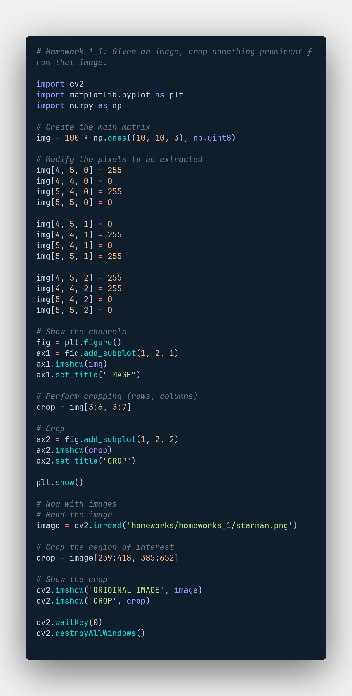
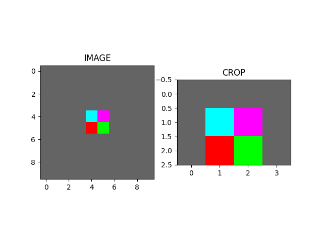
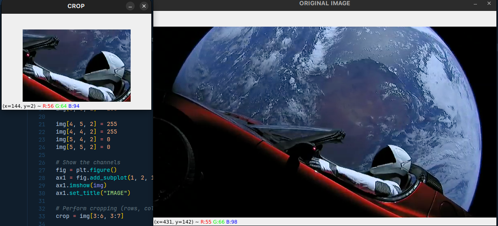
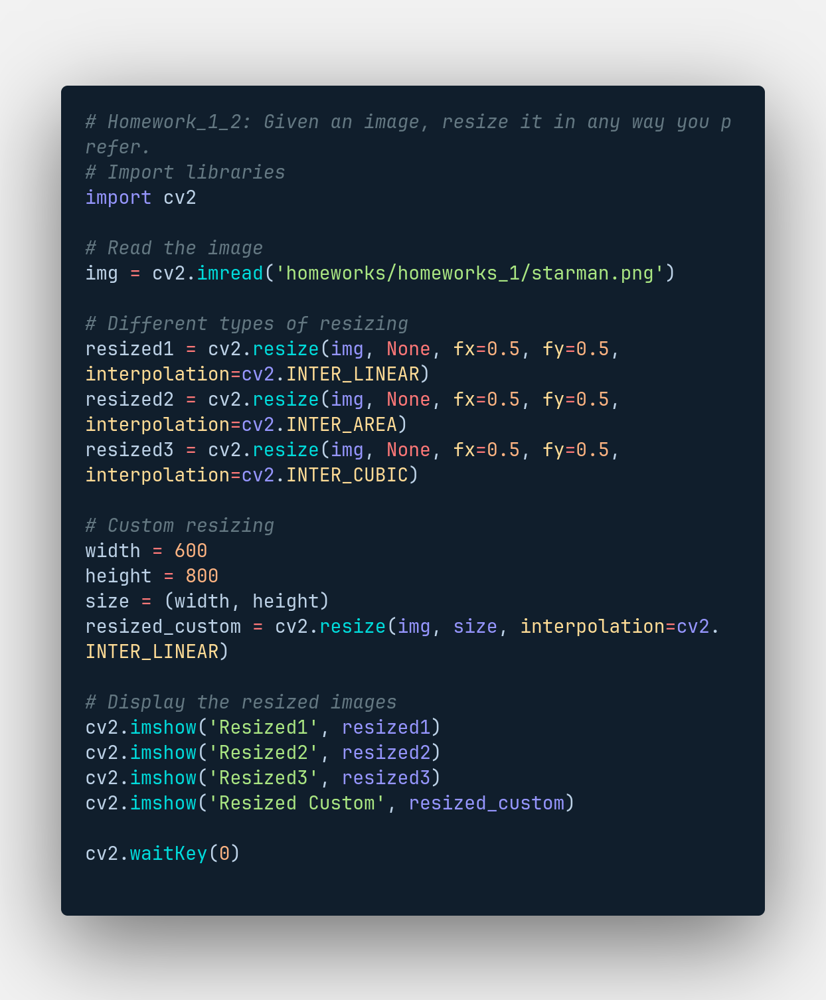
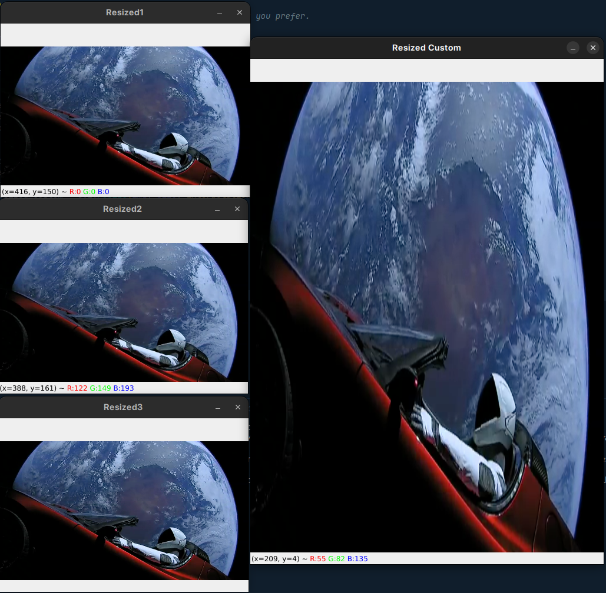

# HOMEWORK 1

## **Exercise 1:** 

Given an image, crop something prominent from that image.

  

  

### **Result:**

  

  

  

  

## **Exercise 2:** 

Given an image, resize it in any way you prefer.

  

  

### **Result:**

  

  

